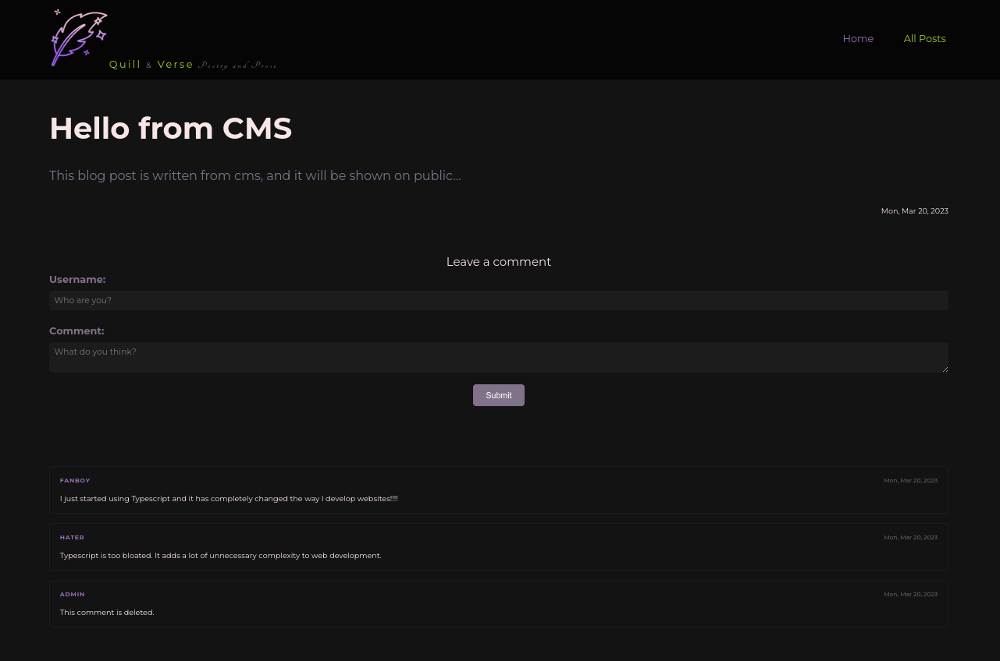

# Blog (Front-end)

MERN stack Blog project's front-end (API) repository. Created with **React**. Deployed on [**Netlify**](https://netlify.app/).

Live Preview ⮕ https://mern-blog-front-end.netlify.app/

---

**Helper Dependencies:**

-   [**Vite**](https://vitejs.dev/) for starting environment and tools
-   [**Sass**](https://sass-lang.com/) for SCSS
-   [**Eslint**](https://eslint.org/) for linting
-   [**Prettier**](https://prettier.io/) for formatting

---

This is the Front-end part of the MERN Blog Project, The other parts are:

-   [**Back-end**](https://github.com/fatiharapoglu/blog-backend) Repository
-   [**Headless CMS**](https://github.com/fatiharapoglu/blog-cms) Repository

---

