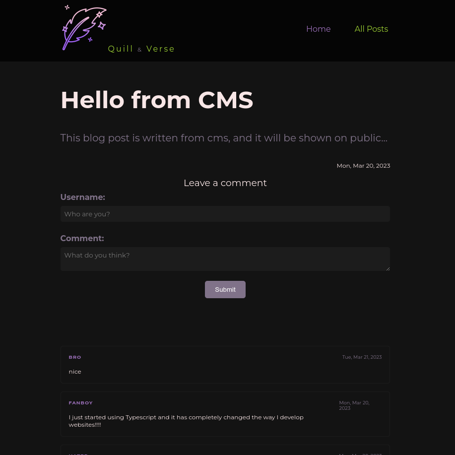

# Blog (Front-end)

MERN stack Blog project's front-end (API) repository. Created with **React**. Deployed on [**Netlify**](https://netlify.app/).

⮕ [Live preview](https://mern-blog-front-end.netlify.app/)

---

This is the Front-end part of the MERN Blog Project, The other parts are:

-   [**Back-end**](https://github.com/fatiharapoglu/blog-backend) Repository
-   [**Headless CMS**](https://github.com/fatiharapoglu/blog-cms) Repository

---

## Features

-   CRUD operations on mongoDB database with admin authorization.
-   Comments for each post.
-   Snackbar feedback.
-   Rate limiter for users to comment.

## Helper Dependencies

-   [Vite](https://vitejs.dev/) for starting environment and tooling
-   [Sass](https://sass-lang.com/) for SCSS
-   [Eslint](https://eslint.org/) for linting
-   [Prettier](https://prettier.io/) for formatting

## How It Looks

